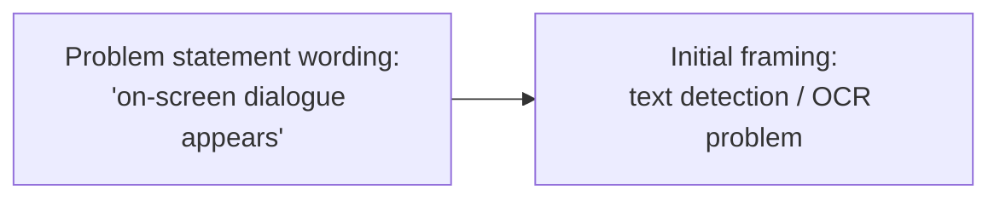
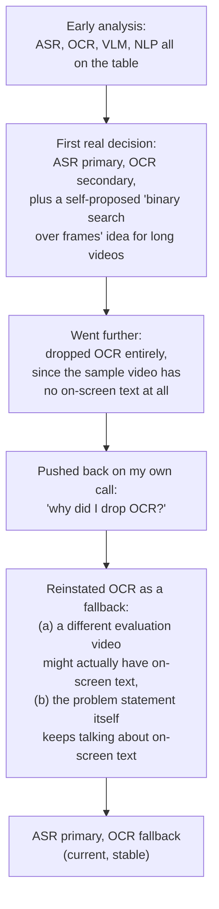
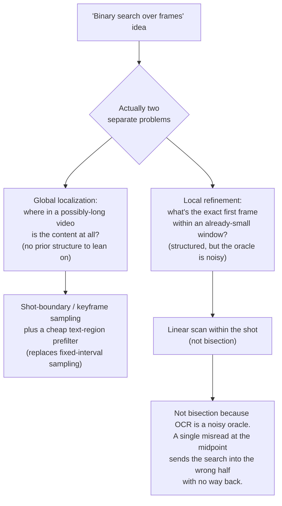
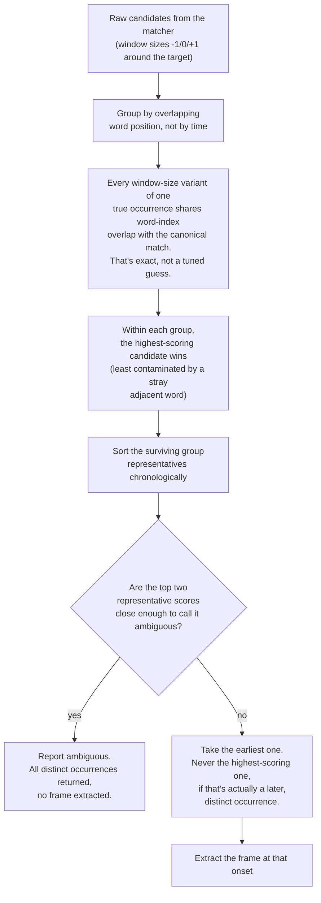
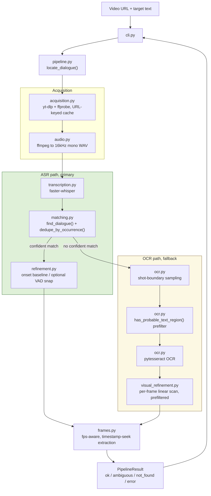
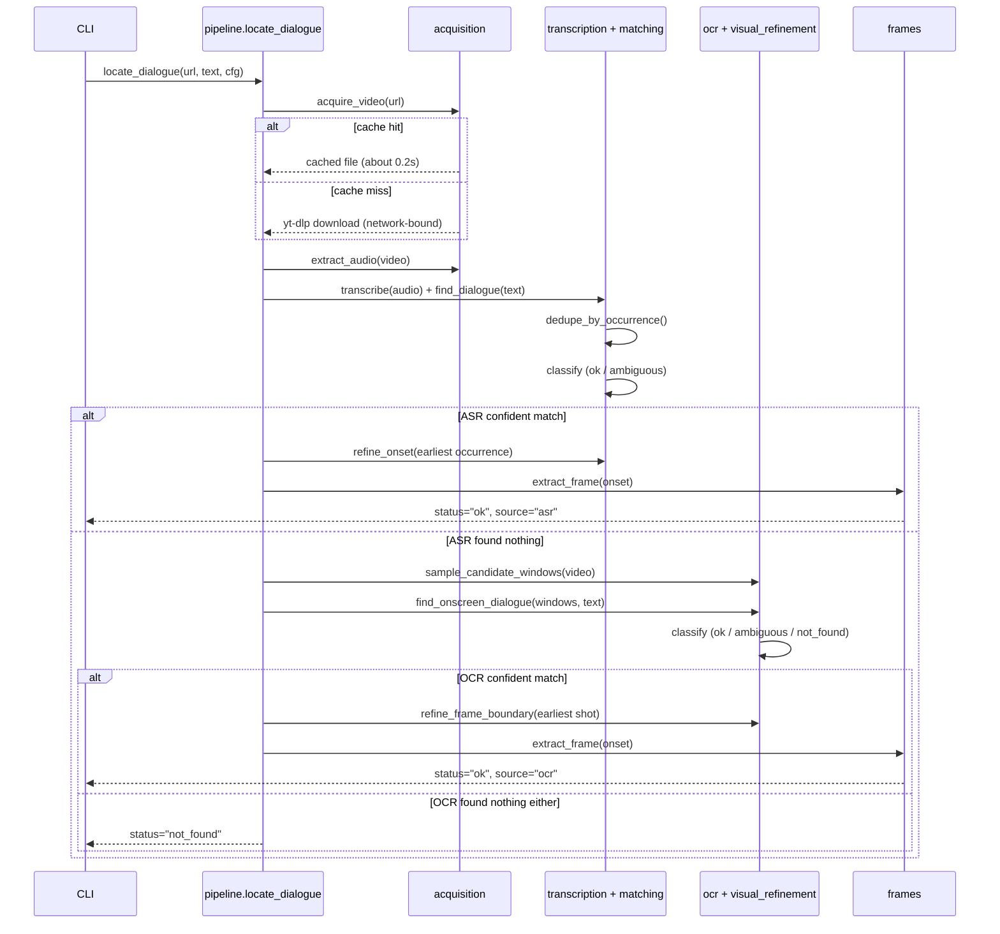

# Approach

This is the story of how I got to the current design, not just a
description of the design itself. `DESIGN.md` is the technical reference.
`prompt.txt` is the verbatim log of the prompts that shaped the build.
`RUN_LOG.md` is the chronological record of every real pipeline run and
what it turned up. This document ties those together into the reasoning:
what I first understood from the problem statement, what I found once I
actually looked at the video, what I considered and threw out, and the
places where I changed my mind after being challenged (sometimes by
myself).

## 1. What I first understood from the problem statement

The problem statement is genuinely centered on a visual event, not a
spoken one:

> "At some point in the video, an **on-screen dialogue** appears... the
> exact video frame in which the dialogue **first appears**."

Read on its own, before I'd looked at any video, that wording points
straight at a text-extraction problem: find the on-screen text, match it,
locate the frame.

Before committing to anything, I ran an analysis-only pass: pull every
explicit requirement out of the statement, flag the ambiguous bits
(specifically what "on-screen dialogue" actually means and what "first
appears" means), inspect the supplied video to see what the target
dialogue actually is in this input, and compare candidate approaches
(ASR, OCR, VLMs, NLP-style text matching, plain frame processing) on
correctness, complexity, runtime, robustness, testability, and how
explainable each one would be. No code yet. The point was to have evidence
before picking a direction, not to reach for whatever sounded most capable.

## 2. What the actual video showed

The supplied video's dialogue isn't on-screen text. It's spoken. That
single fact changes the practical problem immediately: a pure-OCR system
would produce no answer at all against this specific input, no matter how
good the OCR was.

Worth being honest about how I confirmed this: I watched the video myself
rather than having the pipeline inspect it frame by frame at that point
(the download for that inspection got skipped). That gap mattered later,
see section 3.

## 3. The real decision arc, including where I reversed myself

Worth telling this straight rather than smoothing it into a clean line,
because it wasn't one. The ASR/OCR call moved twice.

The first concrete decision I made was already ASR-primary, OCR-secondary,
reasoned from a general point (videos won't always have on-screen text),
not yet from having inspected this specific sample. I also proposed a
"binary search over frames" idea at that point, to avoid scanning a
possibly-long video one frame at a time.

Then I went further and dropped OCR from the design entirely, specifically
because the supplied video doesn't carry the dialogue as visible text.

The interesting turn is what happened next: I questioned my own decision.
Why had I dropped OCR? Digging into that surfaced something I'd glossed
over, that "no on-screen text" was something I'd watched and assumed, not
something the pipeline had actually verified by inspecting frames.

That's what brought OCR back, as a fallback, for two reasons held together
rather than one: a different evaluation video might genuinely rely on
visible text, and the problem statement's own wording keeps pointing at
on-screen dialogue regardless of what the sample happens to contain. OCR
stayed secondary rather than equal-priority though, because on-screen text
extraction is just less reliable than a direct transcript. Rendering lag,
misreads, that kind of thing.

So the "on-screen dialogue" language in the problem statement didn't get
ignored once ASR became primary. It's the actual reason OCR is still in
the architecture at all, instead of being cut as dead weight specific to
one sample video.

## 4. Alternatives I considered

### 4.1 OCR

Covered above. Kept as the fallback, not the primary path. The real
limitations that keep it secondary: it needs decoded video frames, so its
cost scales with video length rather than audio duration; it's noisier
than speech recognition (font, contrast, motion blur all get in the way);
and on-screen text and spoken dialogue aren't guaranteed to line up in
time even when both exist in the same video.

### 4.2 ASR

Became the primary signal once I knew the supplied video was spoken
content. Whisper-family models give timestamped output relatively cheaply
compared to full-video OCR, since the cost scales with audio duration
only, not resolution or frame count. I never treat its output as ground
truth though: the matching layer, shared by both the ASR and OCR paths,
normalizes case, punctuation, and whitespace, and uses fuzzy similarity
specifically because both ASR and OCR produce occasional recognition
errors. I saw this happen for real more than once, more on that in
section 9.

### 4.3 NLP

A general-purpose NLP layer (embeddings-based semantic matching, a
dedicated parsing/NER stage, that kind of thing) was on the table early on
and never got adopted. What the task actually needs from matching is
narrower: normalize text, tolerate small recognition errors, tie a match
to a timestamp. Plain normalization plus a fuzzy-ratio comparison covers
that completely, with no extra dependency. The target phrase is also given
verbatim in the problem statement, not paraphrased, so there's no real
semantic-similarity problem to solve here beyond near-exact text matching.

### 4.4 VLMs

Also considered early, never adopted. A vision-language model could
jointly reason over frames, visible text, and broader scene context, but
this task doesn't call for open-ended visual reasoning. The visual half is
already handled directly by OCR, the audio half by ASR. Bringing in a VLM
would mean a second, much heavier model dependency, less deterministic
output, and real inference cost, in exchange for a capability the task
doesn't actually need. This became a standing rule for the project, not
just a one-off call: no VLM, database, queue, or cloud infrastructure
unless something concrete actually requires it.

## 5. From "binary search over frames" to shot detection plus a linear scan

My original idea, splitting the frame count in half repeatedly to avoid
scanning a long video linearly, was mine. I also went back and questioned
it myself later: is there something better than a plain binary search
here?

The answer I landed on split this into two problems I'd been treating as
one:

Binary search only holds up against a reliable, monotonic predicate over
an ordered space. "Is there text on this frame" isn't reliably monotonic
across a whole long video, there's no prior structure to exploit, the
text could show up anywhere, so that half of the problem is really a
sampling question, not a search question. `ffmpeg`'s scene-change
detection segments the video into shots and decodes one keyframe per shot.
A text or dialogue card is almost always its own static shot, so this
samples where the video's actual structure suggests something changed,
rather than a blind fixed interval that could straddle or miss a short
card entirely. A search algorithm only makes sense once you're already
inside one small shot window, and even there OCR stays a noisy oracle, so
a linear scan (robust to a one-off misread) won out over bisection (which
can't recover from one). There's a real algorithm built for exactly this
kind of noisy threshold search, noisy binary search, and I looked at it
and set it aside deliberately. It's built for search spaces far bigger
than a shot window of fifty to a hundred and fifty frames, so it would
have added real complexity to optimize a stage that's already cheap.

## 6. Fallback, not parallel

Once OCR was back in, the next real question was whether it should run as
a fallback or in parallel with ASR. I wanted the actual facts, not a gut
call, and the honest comparison came down to cost asymmetry: ASR is one
linear pass over the audio track. OCR's shot-boundary detection requires
decoding the entire video frame by frame before any OCR even runs. A
fallback's total cost is a strict subset of parallel's. Parallel pays the
video-decode-and-scan cost on every single run, even in the common case
where ASR alone would have answered correctly. The only real advantage
parallel has is wall-clock latency if you've got the concurrency hardware
for it, and nothing in the problem statement demands that kind of latency.
Fallback won.

## 7. Implementation, and the first real regression

Implementation started with the full pipeline package, unit tests with
every external dependency mocked, and integration tests against a
locally-generated fixture (commit `eeb3af9`). Two real problems showed up
after that, both found by actually running the shipped code against the
real target, not by reading the code and guessing.

**The acquisition format regression.** An earlier attempt to shrink the
download picked yt-dlp's unqualified worst combined format. Run for real
against the target video, that resolved to ok.ru's `mobile` tier, a
format whose audio and resolution metadata isn't even reported reliably,
one step worse than the tier I'd actually validated. It measurably hurt
transcription: "rebels at" came out as "verbels its." The fix, still in
place, only takes the cheap download path when a real quality floor can be
confirmed (240p or above, using metadata the source reports consistently),
and falls back to best quality, never an unverified "worst," when it
can't be confirmed.

**The candidate-selection regression.** A real run against the target
video (see `RUN_LOG.md`) came back with six overlapping ASR candidates for
what was genuinely one spoken occurrence, an artifact of the matcher
trying window sizes one word shorter and one word longer than the target
phrase around the true match. The top two raw scores, 1.0 and 0.943, were
only 0.057 apart, just 0.007 above the ambiguity margin I was using. That
one true occurrence came within a hair of being misreported as two
separate matches. Worse than that: selection was picking the single
highest-scoring candidate across the whole video, not the earliest one, a
real, demonstrable way to end up violating "finds where the dialogue first
appears" if a later occurrence ever happened to score higher than an
earlier, genuinely valid one. Section 11 covers the fix.

## 8. GPU, and what speed actually costs

The first time GPU came up on this project, I applied an int8 compute-type
fix for CPU inference (it avoids a silent, slower float32 fallback) and
deliberately kept the default ASR model at `small` rather than switching
to something faster and smaller. I looked at GPU and cloud options at that
point too, but didn't adopt either into the shipped pipeline: a free-GPU
notebook made sense for my own faster iteration, and a cloud-hosted
managed ASR API got flagged as a real architecture decision that needed
its own explicit sign-off, not something to fold in quietly.

Later I got an actual measured data point instead of a theoretical one.
Switching the ASR model from `small` to `tiny` on the real target video
brought wall-clock transcription time down to 2m36s, against a range of
roughly 4 to 10 minutes I'd seen from `small` on the same video, but it
produced a genuine mis-transcription: "My mind reveals its
stagnation" instead of "rebels at," surviving the match threshold only
narrowly, at a confidence of 0.897. Same category of error as the
acquisition regression in section 7, different cause. That's why `small`
stays the default. The speed-versus-accuracy tradeoff here isn't
theoretical, it produced a wrong answer on the actual target phrase.

The device is a configuration value, `cpu` or `cuda`, not a fork in the
code. Transcription already selects int8 on CPU and float16 on CUDA, so
turning on GPU is a flag, not an architecture change. Since there's no GPU
in this development environment, I put together a standalone Colab
notebook that runs the identical transcription call on a free GPU runtime,
isolating the ASR comparison from network variance in the download step
(the download and the transcription are independent costs; a GPU has zero
effect on the download).

## 9. Text matching

Normalization (lowercasing, stripping punctuation, collapsing whitespace)
and fuzzy similarity live in one shared module, used by both the ASR
matcher and the OCR matcher, so both apply the same tolerance rules
instead of each reinventing their own. This isn't hypothetical: I've now
seen two real mis-transcriptions come through this pipeline ("verbels
its" and "reveals its"), and both still scored appropriately against
threshold. That's exactly the job fuzzy matching is there to do instead of
relying on exact string equality.

## 10. Multimodal evidence

ASR and OCR never run at the same time (section 6), so a real "both
sources disagree on a timestamp" arbitration case never actually came up.
`asr_candidates` and `ocr_candidates` are always both present in the
result, empty if that pipeline never triggered, so the outcome stays
auditable either way. The theoretical multimodal cases (both agree, only
one has evidence, neither does) are handled by the fallback structure and
the explicit result status rather than by a fusion layer I never had
evidence I needed.

## 11. First occurrence

The requirement is the first occurrence, not the best-scoring one. I fixed
this directly off the six-candidate example from section 7.

Why group by overlapping word position and not by how close the
timestamps are: in that real six-candidate example, the start times spread
across 4.4 seconds, because the widest window happened to pull in a word
from the tail end of an unrelated previous sentence, across a real speech
pause. A seconds-based cutoff can't tell "same occurrence, wide time
spread because of an adjacent pause" apart from "different occurrence,
narrow time gap." That 4.4-second spread is real evidence either a wide
cutoff or a narrow one would get this wrong in one direction or the other.
Grouping by word position instead is exact rather than tuned: any
window-size variant of one true occurrence is guaranteed, by how the
sliding search itself works, to overlap the canonical match's word
indices, since it only ever trims or extends by one word at a boundary. I
confirmed the fix worked live afterward: the same real input that used to
produce six raw candidates now produces exactly one.

OCR never needed this deduplication step. Its candidates are already one
per shot by construction, so they're distinct from the start, but I gave
it the same earliest-not-highest-scoring selection rule anyway, for
consistency.

## 12. Temporal refinement

There are two refiners, one per pipeline, and both lean on the same
reasoning from section 5.

On the ASR side, the baseline is just the matched word's own start time.
An optional local audio-energy snap can tighten that within a short
window, using a linear scan rather than bisection, for the same reason as
before: it's a noisy predicate and a single bad read shouldn't be able to
derail the whole search. It's off by default, since ASR word timestamps
are usually precise enough on their own.

On the OCR side, once a shot gets flagged, its window is already small,
typically fifty to a hundred and fifty frames, so the refiner scans every
real frame in it, requiring the match to hold on two consecutive frames
before accepting the first one, to survive a one-off misread. I found and
fixed a real gap here: the cheap edge-density prefilter already used in
the coarse OCR pass wasn't being reused in this fine-grained scan, so it
was paying for a full Tesseract call on every single frame in a shot
regardless of whether that frame plausibly had any text on it at all. On a
realistic synthetic case (a three-second shot at 24fps with text only in
the last four frames), that's 73 Tesseract calls before the fix and 4
after.

## 13. Frame localization and variable frame rate

The frame index that gets reported is a simple calculation: how many
seconds into the video the timestamp falls, times the frame rate. But
extraction itself never trusts that arithmetic. It always seeks by the
real timestamp and reads back whichever frame the decoder actually
presents at that point. That means the same single code path was already
correct for both constant and variable frame rate video, without needing a
separate branch for VFR at all. That was a real claim the design made, but
it had never actually been tested against genuinely non-uniform frame
spacing until I checked it. I generated a real VFR fixture, an irregular
frame-keep pattern with variable sync, and confirmed with a probe that the
nominal and actual frame rates genuinely diverged on it. Then I ran frame
extraction against it. It passed without any code
change, which confirmed the existing design rather than forcing a fix.

## 14. Performance, and what actually matters

Real numbers from actual runs, not estimates.

Download is network-bound. A real ~145MB file took multiple minutes on a
flaky connection on a cold cache, and 0.18 seconds once cached. I solved
that with a URL-and-format-keyed cache plus concurrent fragment downloads.

ASR is the cost that actually dominates now. The real ok.ru source turned
out to be a full video roughly fifty to sixty minutes long, not a short
clip, and the pipeline transcribes the entire file before any matching
happens, regardless of where the answer actually falls. A match five and a
half minutes in still costs the full fifty-to-sixty minutes of
transcription. On this machine, `small` with int8 runs at roughly three
times realtime (a five-minute video transcribed in about a minute and a
half).

OCR never got exercised against a real downloaded video in this
environment, since Tesseract was never installed here, so this is
assessment by reading the code rather than by measurement. The real cost
driver looks like it's the subprocess spawn for each shot or frame
examined, not the decode itself.

Frame extraction is negligible either way, a single call, a one-time cost
regardless of video length.

I looked at streaming or early-stop ASR, transcribing and matching
incrementally and stopping as soon as a confident earliest match turns up,
as the theoretically "correct" fix for the ASR cost, and deliberately
didn't build it. It's a real architecture change with a real correctness
risk of its own: you can't be certain something found early isn't a later,
cleaner duplicate of an earlier weak match without seeing the whole
transcript, which is exactly what the fix in section 11 depends on. Not
worth that complexity without evidence it actually pays off.

## 15. Testing

Unit tests stay fast, offline, and mock every external dependency: ffmpeg,
yt-dlp, the ASR model, Tesseract. Integration tests exercise the real
components against locally-generated fixtures and live separately from the
unit tests. Every fix in this project got checked against the full suite,
not just the tests it directly touched, before I called it done.

Coverage I added along the way ties directly to a real finding above:
multi-occurrence selection (an earlier, lower-scoring match against a
later, higher-scoring one; two overlapping windows that are really one
occurrence; genuinely separate occurrences; the real six-candidate case
reproduced as a test; ambiguity checked against distinct occurrences
rather than raw window duplicates), the OCR prefilter reuse (asserting the
expensive call never happens once the cheap one rejects a frame), and
variable frame rate (a real fixture, not a mock).

## 16. Architecture, as it stands

## 17. Pipeline sequence

